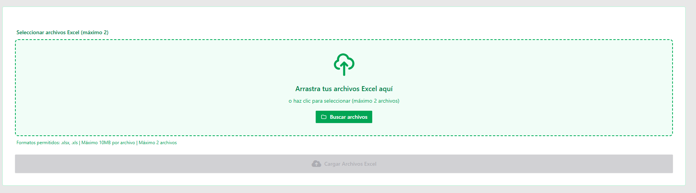

Que el usuario la elija.

Si es que el usuario el dia 22 sube una carga que debía de ser del día 20. Entonces que el flujo sea asi.
Usuario carga el excel. De primera instancia le dice que De que fecha es la carga? Automaticamente pone la del dia actual. Por ejemplo si ahorita me mandan los exceles del dia 22 entonces me agarre los del dia 22/05/2026

Pero ya depende del usuario si es que lo quiere modificar para que la carga se suba para el dia 20.
Hay que ser flexibles con el usuario asi que esta pregunta ¿De que fecha es la carga? se le tiene que hacer después de accionar el boton.
Cargar archivos Excel. upload.html

Que interactue tanto con mouse(cursor) como con el teclado. Si es que el usuario presiona enter Que se suba la carga.

